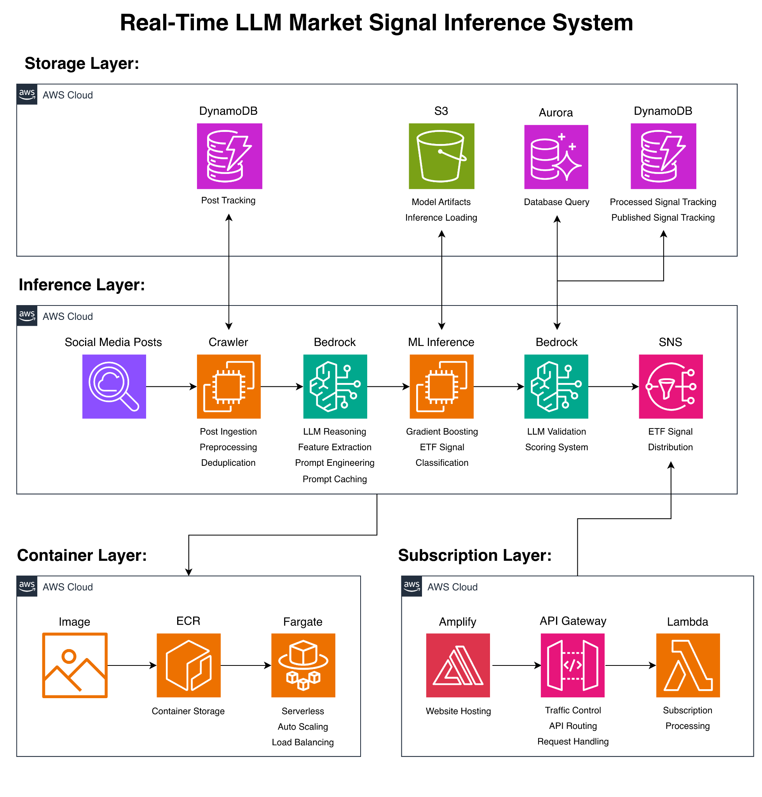

# Real-Time LLM Market Signal Inference Engine

## Overview

Built a real-time, low-latency AI inference system that converts live social media signals into actionable ETF trading recommendations within seconds.

The system combines:

- LLM-based structured feature extraction using AWS Bedrock
- Machine learning inference using XGBoost classifiers
- Containerized streaming deployment on AWS ECS with Fargate
- Event-driven cloud architecture using SNS, Lambda, API Gateway, DynamoDB, S3, and Aurora

It is designed as a continuously running, production-style inference system with persistent execution, low-latency signal generation, and automated signal delivery to end users.

Please use this [subscription link](https://production.d2go4b2opx7lvu.amplifyapp.com/) to sign up for testing.

 

## Key Capabilities

- Real-time ingestion and processing of live social media posts
- Structured LLM feature extraction into standardized numerical features
- ETF-specific ML inference using trained XGBoost models
- Secondary LLM validation and scoring for signal quality control
- Event-driven signal distribution through an email subscription system
- Continuous execution with restart handling and fault recovery

 

## System Architecture

### 1. Real-Time Inference Pipeline

The inference pipeline performs the following steps:

- Ingests live social media posts through a crawler service
- Performs preprocessing, cleaning, and deduplication
- Converts unstructured post content into structured numerical features using an LLM
- Runs ETF-specific ML inference for signal prediction
- Applies a secondary LLM-based validation and scoring layer
- Publishes qualified signals to downstream delivery systems via SNS

### 2. Containerized Inference Deployment

The inference service is containerized and deployed in AWS:

- Docker image stored in Amazon ECR
- Deployed on AWS ECS with Fargate for serverless container execution
- Supports persistent operation and production-style deployment
- Models are preloaded from S3 at container startup to reduce runtime latency

### 3. Cloud-Based Subscription System

Users can subscribe to receive real-time ETF signals.

Components:

- Frontend: AWS Amplify
- API Layer: Amazon API Gateway
- Backend: AWS Lambda
- Messaging: Amazon SNS

Signal delivery flow:

`User -> Amplify -> API Gateway -> Lambda -> SNS -> Email Notification`

SNS acts as the central event bus connecting signal generation with subscriber delivery.

### 4. Storage Layer

The system uses multiple storage services for different purposes:

- DynamoDB (Posts): tracks processed posts for deduplication
- DynamoDB (Signals): stores processed and published signals
- S3: stores model artifacts and training data
- Aurora: supports validation, threshold, and scoring queries

### 5. Model Training Pipeline

The training pipeline is built using historical post data and ETF market data.

It includes:

- Hyperparameter search
- Multi-run stability evaluation
- Threshold optimization
- High-confidence subset filtering

Trained models are stored in S3 and loaded into the live inference pipeline during deployment.

### 6. Low-Latency System Design

The system is designed to reduce inference latency:

- Models are preloaded into memory to avoid runtime I/O
- Concurrent LLM invocation is used to improve throughput
- Event-driven architecture reduces blocking dependencies
- Signals are designed to be generated within seconds of post ingestion

### 7. LLM Feature Engineering

Instead of relying on raw embeddings, the system uses structured LLM outputs as the core feature representation.

The LLM:

- Converts text into a multi-dimensional structured feature space
- Uses a strict ordinal scoring schema
- Captures geopolitical, economic, and market-relevant signals

Benefits of this design:

- Improved model stability
- Higher interpretability
- Better downstream ML performance

### 8. Machine Learning Layer

- Model family: XGBoost classifiers
- Input: structured LLM-generated features
- Output: buy or sell ETF signal predictions

Each ETF uses its own trained model group for inference.

### 9. Performance Evaluation

Signals are evaluated against future ETF price movement using VWAP-based forward return windows.

Evaluation supports multiple forward horizons and includes metrics such as:

- Directional accuracy
- Confidence-filtered performance
- Cross-ETF robustness

 

## Target ETF Coverage

The system supports multiple ETF categories:

- Equities: QQQ, SPY, DIA
- Commodities: UCO, UGL
- Macro: UUP, TLT
- Volatility: VXX
- Sectors: XLF, XLE, SOXX
- Leveraged exposure: TSLL, NVDU

 

## Roadmap

Planned future improvements include:

- Real-time news integration through RAG or agent-based workflows
- Multi-modal signal ingestion across text, image, and video
- Further latency optimization and scaling improvements

 

## Why This Project Matters

This project demonstrates:

- End-to-end ML system design beyond just model training
- Real-time inference under latency constraints
- Hybrid LLM + ML architecture
- Cloud-native production deployment on AWS
- Event-driven system design with a user-facing delivery product
